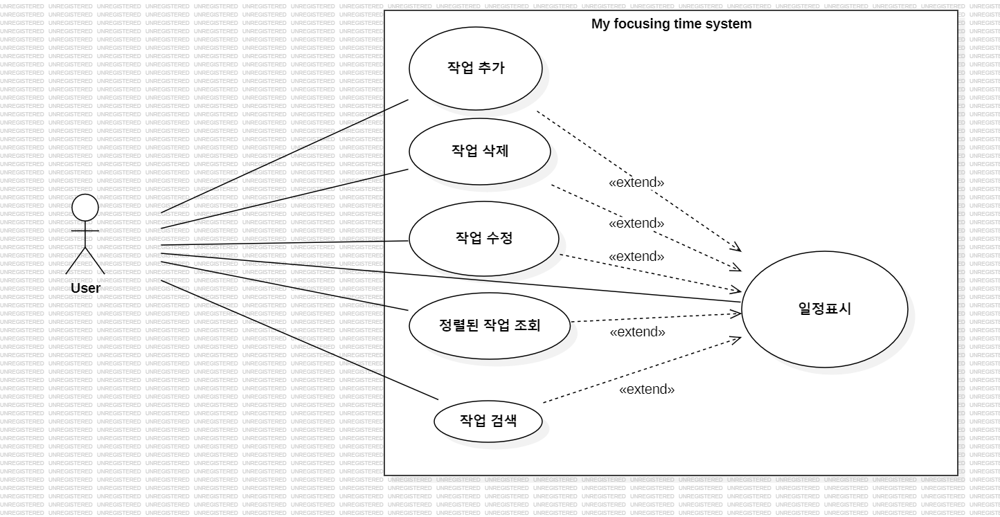

# My focusing time  
### Analysis document

---

| Student No | Name | E-mail |
|------------|------|--------|
| 22411976 | 신주현 | s5264075@gmail.com |

---

## [ Revision history ]

| Revision date | Version # | Description | Author |
|---------------|----------|-------------|--------|
|  04/11/2026   |  1.00    | First Writing | 신주현 |

---

# = Contents =

1. Introduction
2. Use case analysis  
3. Domain analysis  
4. User Interface prototype  
5. Glossary  
6. References

---

# 1.Introduction
## 1) Executive Summary

“My Focusing Time”은 사용자가 일상적인 할 일을 효율적으로 관리할 수 있도록 설계된 To-Do List 프로그램이다. 현대인들은 다양한 일정과 업무를 동시에 처리해야 하는 환경 속에서 개인적인 스케줄까지 함께 관리해야 하므로, 이를 보다 간편하고 체계적으로 정리할 수 있는 맞춤형 애플리케이션의 필요성이 증가하고 있다.

본 시스템은 기존 일정 관리 애플리케이션에서 발생하는 복잡한 스케줄 추가 과정과 비직관적인 인터페이스의 문제를 개선하고, 누구나 쉽게 사용할 수 있는 직관적인 사용자 환경을 제공하는 것을 목표로 한다. 사용자는 할 일을 추가, 수정 및 삭제할 수 있으며, 각 항목에 대해 완료 여부를 표시할 수 있다.

또한 우선순위 설정 기능을 통해 중요한 작업을 보다 효율적으로 관리할 수 있도록 구성하였다. “My Focusing Time”은 객체지향 프로그래밍 개념을 적용하여 구조적으로 설계되었으며, 유지보수성과 확장성을 고려하여 구현되었다.

---

# 2.Use case analysis

## 1) Use case diagram

## 2) Use case description

| Use Case #1 : Login |  |
| --------- | -------- |
| GENERAL CHARACTERISTICS| |
| Summary | 사용자가 아이디, 비밀번호를 입력하여 로그인 성공/ 실패|
