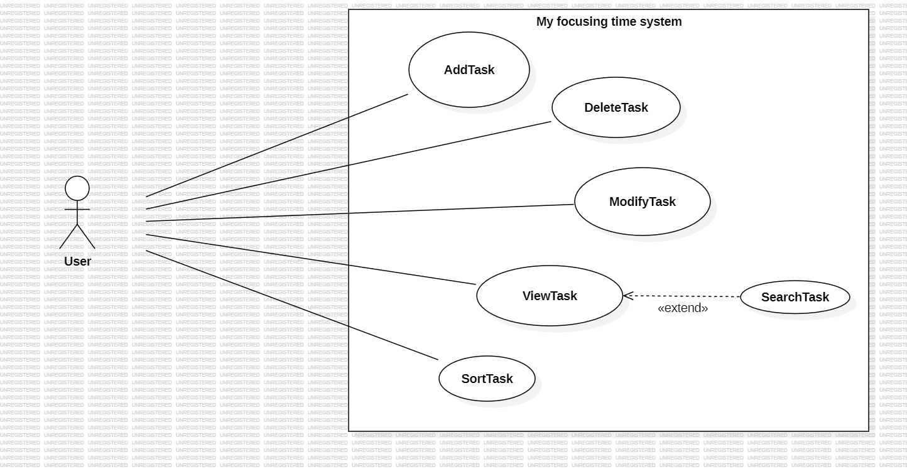
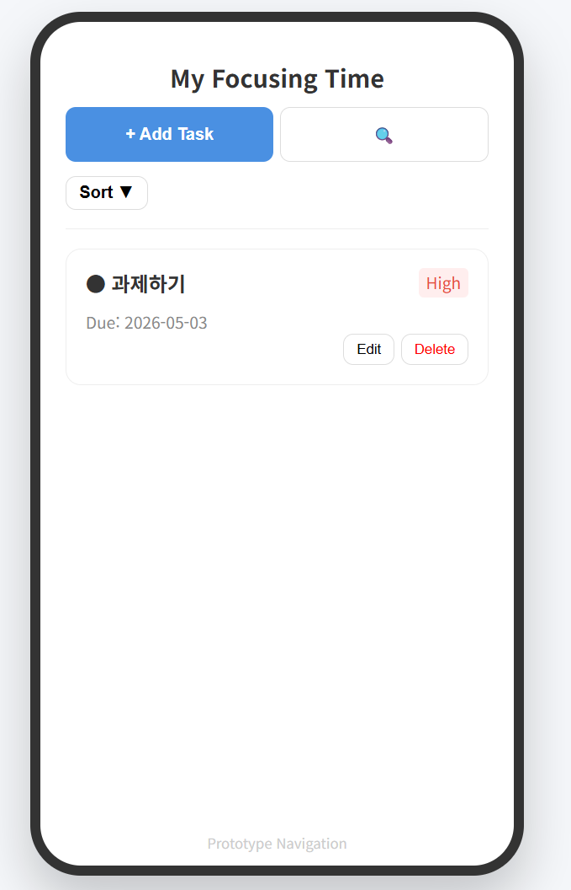
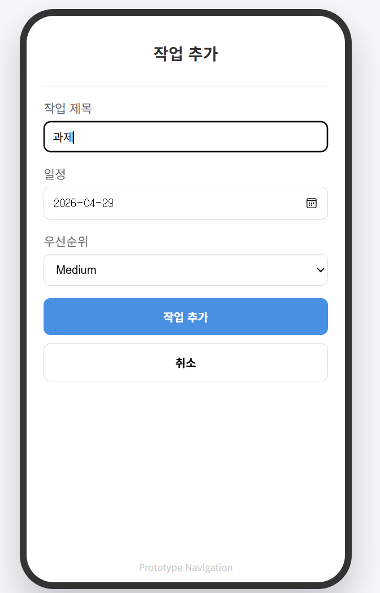
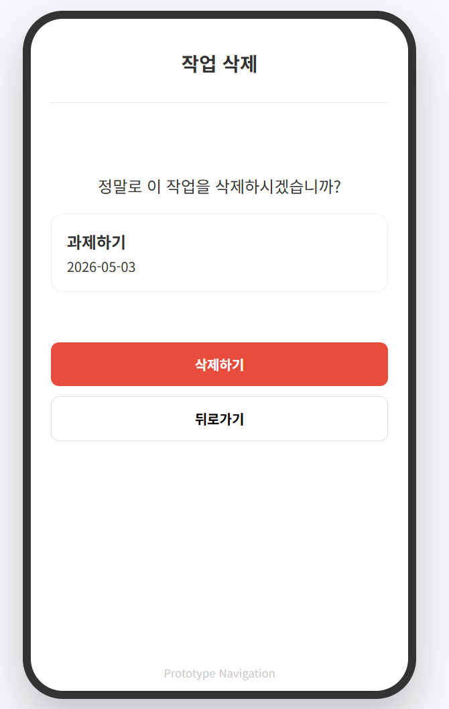
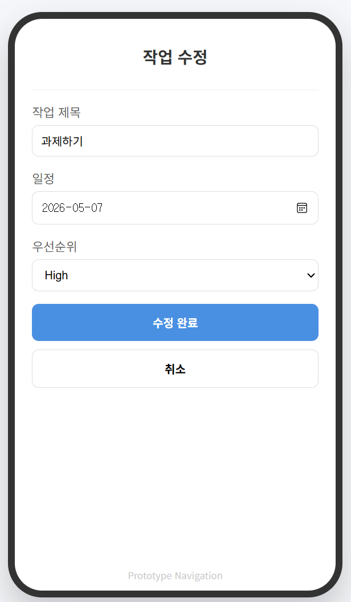
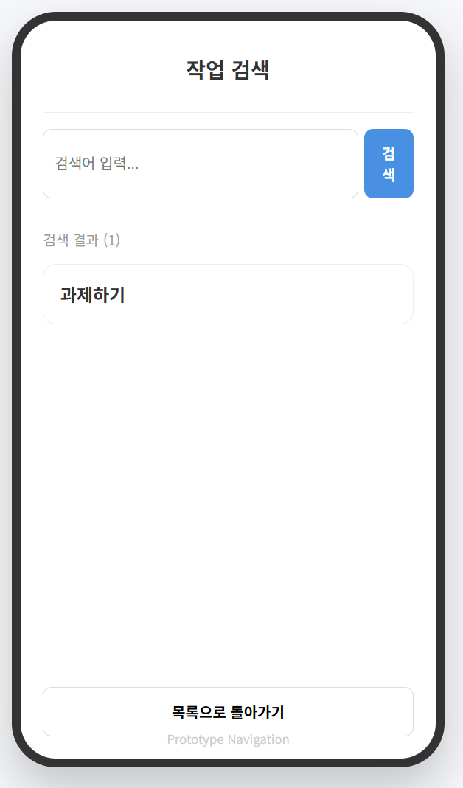

# My focusing time  
### Analysis document

---

| Student No | Name | E-mail |
|------------|------|--------|
| 22411976 | 신주현 | s5264075@gmail.com |

---

## [ Revision history ]

| Revision date | Version # | Description | Author |
|---------------|----------|-------------|--------|
|  05/03/2026   |  1.00    | First Writing | 신주현 |
|  05/31/2026   |  1.10    | Second Writing | 신주현 |

---

# = Contents =

1. Introduction
2. Use case analysis  
3. Domain analysis  
4. User Interface prototype  
5. Glossary  
6. References

---

# 1.Introduction
## 1) Executive Summary

“My Focusing Time”은 사용자가 일상적인 할 일을 효율적으로 관리할 수 있도록 설계된 To-Do List 프로그램이다. 현대인들은 다양한 일정과 업무를 동시에 처리해야 하는 환경 속에서 개인적인 스케줄까지 함께 관리해야 하므로, 이를 보다 간편하고 체계적으로 정리할 수 있는 맞춤형 애플리케이션의 필요성이 증가하고 있다.

본 시스템은 기존 일정 관리 애플리케이션에서 발생하는 복잡한 스케줄 추가 과정과 비직관적인 인터페이스의 문제를 개선하고, 누구나 쉽게 사용할 수 있는 직관적인 사용자 환경을 제공하는 것을 목표로 한다. 사용자는 할 일을 추가, 수정 및 삭제할 수 있으며, 각 항목에 대해 완료 여부를 표시할 수 있다.

또한 우선순위 설정 기능을 통해 중요한 작업을 보다 효율적으로 관리할 수 있도록 구성하였다. “My Focusing Time”은 객체지향 프로그래밍 개념을 적용하여 구조적으로 설계되었으며, 유지보수성과 확장성을 고려하여 구현되었다.

---

# 2.Use case analysis

## 1) Use case diagram

## 2) Use case description

|  |  |
|------|------|
| Use Case #1 : AddTask |  
| GENERAL CHARACTERSTICS |
| Summary | 사용자가 작업을 추가하는 기능 |
| Scope | To-Do List 시스템 |
| Level | User Level |
| Author | 신주현 |
| Last Update | 2026-05-03 |
| Status | Analysis |
| Primary Actor | User |
| Preconditions | 애플리케이션이 실행된 상태여야 한다. |
| Trigger | 사용자가 작업 추가 기능을 선택할 때 |
| Success Post Condition | 작업이 시스템에 정상적으로 저장된다. 이후 사용자는 등록된 작업을 확인할 수 있다. |
| Failed Post Condition | 작업이 저장되지 않는다. 사용자는 작업 목록에서 해당 작업을 확인할 수 없다. |
| MAIN SUCCESS SCENARIO | 
| Step | Action |
| S | User가 새로운 작업을 등록한다. |
| 1 | 시스템은 작업 추가 기능을 선택한다. |
| 2 | 시스템은 작업 입력 화면(제목, 일정, 우선순위 등)을 표시한다. |
| 3 | User는 작업 정보를 입력한다. |
| 4 | User는 작업추가 버튼을 누른다. |
| 5 | 시스템은 입력값의 유효성을 검증한다. |
| 6 | 시스템은 작업을 저장한다. |
| 7 | 시스템은 작업 추가 완료 메시지를 휴대폰 팝업 창으로 출력한다. |
| 8 | 시스템은 갱신된 작업 목록 화면을 표시한다. |
| EXTENSION SCENARIOS | 
| Step | Branching Action |
| 5 | 5a	입력 정보가 유효하지 않은 경우 |
| | 5a.1	시스템은 오류 메시지를 휴대폰 팝업 창으로 출력한다. |
| | 5b	필수 항목이 입력되지 않은 경우 |
| | 5b.1	시스템은 필수 입력값 누락 메시지를 휴대폰 팝업 창으로 출력한다. |
| RELATED INFORMATION |
| Performance | <= 3 Seconds |
| Frequency | 사용자당 하루 평균 2~5회 |
| Concurrency | 제한 없음 |
| Due Date| |

|  |  |
|------|------|
| Use Case #2 : DeleteTask |  
| GENERAL CHARACTERSTICS |
| Summary | 사용자가 기존에 등록된 작업을 삭제하는 기능 |
| Scope | To-Do List 시스템 |
| Level | User Level |
| Author | 신주현 |
| Last Update | 2026-05-31 |
| Status | Analysis |
| Primary Actor | User |
| Preconditions | 애플리케이션이 실행된 상태이며, 삭제할 작업이 존재해야 한다. |
| Trigger | 사용자가 작업 삭제 기능을 선택할 때 |
| Success Post Condition | 선택한 작업이 시스템에서 정상적으로 삭제된다. |
| Failed Post Condition | 작업이 삭제되지 않으며, 기존 작업 목록이 유지된다. |
| MAIN SUCCESS SCENARIO | 
| Step | Action |
| S | User가 기존 작업을 삭제한다. |
| 1 | User가 작업 삭제 기능을 선택한다. |
| 2 | 시스템은 작업 목록을 표시한다. |
| 3 | User는 삭제할 작업을 선택한다. |
| 4 | User는 삭제 버튼을 누른다. |
| 5 | 시스템은 선택된 작업을 삭제한다. |
| 6 | 시스템은 작업 삭제 완료 메시지를 휴대폰 팝업 창으로 출력한다. |
| 7 | 시스템은 갱신된 작업 목록 화면을 표시한다. |
| EXTENSION SCENARIOS |
| Step | Branching Action |
| 4 | 4a 사용자가 삭제를 취소한 경우(뒤로가기) |
| | 4a.1 시스템은 변경사항을 저장하지 않고 이전 화면으로 돌아간다. |
| RELATED INFORMATION |
| Performance | <= 3 Seconds |
| Frequency | 사용자당 하루 평균 1~3회 |
| Concurrency | 제한 없음 |
| Due Date| |

|  |  |
|------|------|
| Use Case #3 : ModifyTask |  
| GENERAL CHARACTERSTICS |
| Summary | 사용자가 기존에 등록된 작업의 정보를 수정하는 기능 |
| Scope | To-Do List 시스템 |
| Level | User Level |
| Author | 신주현 |
| Last Update | 2026-05-31 |
| Status | Analysis |
| Primary Actor | User |
| Preconditions | 애플리케이션이 실행된 상태이며, 수정할 작업이 존재해야 한다. |
| Trigger | 사용자가 작업 수정 기능을 선택할 때 |
| Success Post Condition | 선택한 작업의 정보가 정상적으로 수정되어 저장된다. |
| Failed Post Condition | 작업이 수정되지 않으며, 기존 정보가 유지된다. |
| MAIN SUCCESS SCENARIO | 
| Step | Action |
| S | User가 기존 작업의 정보를 수정한다. |
| 1 | User가 작업 수정 기능을 선택한다. |
| 2 | 시스템은 기존 작업 정보를 포함한 수정 화면을 표시한다. |
| 3 | User는 수정할 작업을 선택한다. |
| 4 | 시스템은 선택된 작업의 상세 정보를 표시한다. |
| 5 | User는 작업 정보를 수정한다. |
| 6 | User는 수정 완료 버튼을 누른다. |
| 7 | 시스템은 입력된 정보의 유효성을 검증한다. |
| 8 | 시스템은 수정된 내용을 저장한다. |
| 9 | 시스템은 작업 수정 완료 메시지를 휴대폰 팝업 창으로 출력한다. |
| 10 | 시스템은 갱신된 작업 목록 화면을 표시한다. |
| EXTENSION SCENARIOS |
| Step | Branching Action |
| 6 | 6a 사용자가 수정을 취소한 경우 |
| | 6a.1 시스템은 변경사항을 저장하지 않고 이전 화면으로 돌아간다. |
| 7 | 7a 입력 정보가 유효하지 않은 경우 |
| | 7a.1 시스템은 오류 메시지를 휴대폰 팝업 창으로 출력한다. |
| | 7b 필수 항목이 입력되지 않은 경우 |
| | 7b.1 시스템은 필수 입력값 누락 메시지를 휴대폰 팝업 창으로 출력한다. |
| RELATED INFORMATION |
| Performance | <= 3 Seconds |
| Frequency | 사용자당 하루 평균 1~3회 |
| Concurrency | 제한 없음 |
| Due Date| |

|  |  |
|------|------|
| Use Case #4 : ViewTask |  
| GENERAL CHARACTERSTICS |
| Summary | 사용자가 저장된 작업 목록을 조회하는 기능 |
| Scope | To-Do List 시스템 |
| Level | User Level |
| Author | 신주현 |
| Last Update | 2026-05-31 |
| Status | Analysis |
| Primary Actor | User |
| Preconditions | 애플리케이션이 실행된 상태여야 한다. |
| Trigger | 사용자가 작업 조회 기능을 선택할 때 |
| Success Post Condition | 조건에 맞는 작업 목록이 화면에 정상적으로 출력된다. |
| Failed Post Condition | 작업 목록을 출력하지 않는다. |
| MAIN SUCCESS SCENARIO | 
| Step | Action |
| S | User가 작업 목록을 조회한다. |
| 1 | User가 작업 목록 조회 기능을 선택한다. |
| 2 | 시스템은 현재 저장된 작업 목록을 화면에 출력한다. |
| EXTENSION SCENARIOS | 
| Step | Branching Action |
| 2 | 2a 현재 저장된 작업 목록이 없는경우 |
|  | 2a.1 시스템은 빈 작업 목록 화면을 출력한다. |
| 2 | 2b User가 검색어를 입력한 경우 |
| | 2b.1 시스템은 입력된 검색어를 기반으로 작업 목록을 조회한다. |
| | 2b.2 시스템은 검색 결과 목록을 화면에 출력한다. |
| | 2b.3 검색 결과가 없는 경우 시스템은 "검색 결과가 없습니다." 메시지를 휴대폰 팝업 창으로 출력한다. |
| RELATED INFORMATION |
| Performance | <= 3 Seconds |
| Frequency | 사용자당 하루 평균 3~5회 |
| Concurrency | 제한 없음 |
| Due Date| |

|  |  |
|------|------|
| Use Case #5 : SortTask |  
| GENERAL CHARACTERSTICS |
| Summary | 사용자가 선택한 기준에 따라 작업 목록을 정렬하는 기능 |
| Scope | To-Do List 시스템 |
| Level | User Level |
| Author | 신주현 |
| Last Update | 2026-05-31 |
| Status | Analysis |
| Primary Actor | User |
| Preconditions | 애플리케이션이 실행된 상태이며, 하나 이상의 작업이 존재해야 한다. |
| Trigger | 사용자가 작업 정렬 기능을 선택할 때 |
| Success Post Condition | 선택한 기준에 따라 작업 목록이 정렬되어 화면에 출력된다. |
| Failed Post Condition | 작업 목록이 정렬되지 않고 기존 상태가 유지된다. |
| MAIN SUCCESS SCENARIO | 
| Step | Action |
| S | User가 작업 목록을 정렬한다. |
| 1 | User가 작업 정렬 기능을 선택한다. |
| 2 | 시스템은 정렬 기준 선택 화면을 출력한다. |
| 3 | User는 정렬 기준을 선택한다. |
| 4 | 시스템은 선택된 기준에 따라 작업 목록을 정렬한다. |
| 5 | 시스템은 정렬된 작업 목록을 화면에 출력한다. |
| EXTENSION SCENARIOS | 
| Step | Branching Action |
| 3 | 3a 정렬 기준이 선택되지 않은 경우 |
|  | 3a.1 시스템은 기존 작업 목록 화면을 유지한다. |
| 4 | 4a 정렬 가능한 작업이 없는 경우 |
| | 4a.1 시스템은 빈 작업 목록 화면을 출력한다. |
| RELATED INFORMATION |
| Performance | <= 3 Seconds |
| Frequency | 사용자당 하루 평균 3~5회 |
| Concurrency | 제한 없음 |
| Due Date | |

---

# 3. Domain analysis

### 1) Task
작업 데이터를 표현하는 클래스다.
작업의 제목, 일정, 우선순위, 완료 여부 등의 정보를 가지며, 시스템에서 관리되는 기본적인 작업 데이터를 포함한다.

### 2) TaskManager
작업을 관리하는 클래스다.
작업의 추가, 수정, 삭제 및 조회 기능을 수행하며, 작업 목록을 저장하고 갱신하는 역할을 담당한다.
또한 사용자의 요청에 따라 작업 검색 및 정렬 기능을 수행한다.

### 3) Validator
입력값 검증을 담당하는 클래스다.
작업 추가 및 수정 과정에서 입력된 정보의 유효성을 검사하며, 필수 입력값 누락이나 형식 오류가 발생한 경우 이를 사용자에게 알린다.

---

# 4) User Interface prototype 

### 1) Task List Screen

작업 목록 화면

사용자가 애플리케이션을 실행하면 다음과 같은 작업 목록 화면이 보인다.
사용자는 등록된 작업들을 확인할 수 있으며, 작업 추가 버튼을 통해 새로운 작업을 추가할 수 있다.
또한 각 작업을 선택하면 수정 및 삭제를 수행할 수 있다. 검색 및 정렬 기능을 사용할 수 있다.

### 2) Add Task Screen

작업 추가 화면

작업 목록 화면에서 작업 추가 버튼을 누르면 다음과 같은 작업 추가 화면이 보인다.
사용자는 작업 제목, 일정, 우선순위를 입력할 수 있다.
작업 추가 버튼을 누르면 작업이 저장되며, 입력값이 유효하지 않은 경우 오류 메시지가 출력된다.

### 3) Delete Task Screen

작업 삭제 화면

작업 목록 화면에서 삭제할 작업을 선택하고 삭제 버튼을 누르면 다음과 같은 삭제 화면이 보인다.
사용자는 삭제할 작업의 정보를 확인할 수 있으며, 삭제 버튼을 누르면 해당 작업이 삭제된다.
삭제를 진행하지 않고 뒤로가기 버튼을 누르면 이전 화면으로 돌아간다.

### 4) Edit Task Screen

작업 수정 화면

작업 목록에서 특정 작업을 선택하면 다음과 같은 작업 수정 화면이 보인다.
기존 작업 정보가 표시되며, 사용자는 이를 수정할 수 있다.
수정 완료 버튼을 누르면 변경사항이 저장되며, 취소 시 이전 화면으로 돌아간다.

### 5) Search Screen

작업 검색 화면

작업 목록 화면에서 검색 기능을 선택하면 다음과 같은 검색 화면이 보인다.
사용자는 키워드를 입력하여 원하는 작업을 검색할 수 있다.
검색 결과는 목록 형태로 화면에 출력된다.

---

#) 5.Glossary

| | |
|---|---|
| Task | 사용자가 수행해야 할 작업 단위로, 제목, 일정, 우선순위 등의 정보를 포함한다. |
| Priority | 작업의 중요도를 나타내는 값으로, High, Medium, Low로 구분된다. |
| Due Date | 작업이 완료되어야 하는 마감 날짜를 의미한다. |
| Task List | 시스템에 저장된 모든 작업들의 목록을 의미한다. |
| UI | 사용자가 시스템과 상호작용하기 위해 사용하는 화면 및 요소를 의미한다. |
| Use case | 사용자가 시스템을 통해 수행하는 기능적 시나리오를 정의한 것이다.|
| Validation | 입력된 데이터의 유효성을 검사하는 과정을 의미한다.|

---

# 6) Reference
없음

