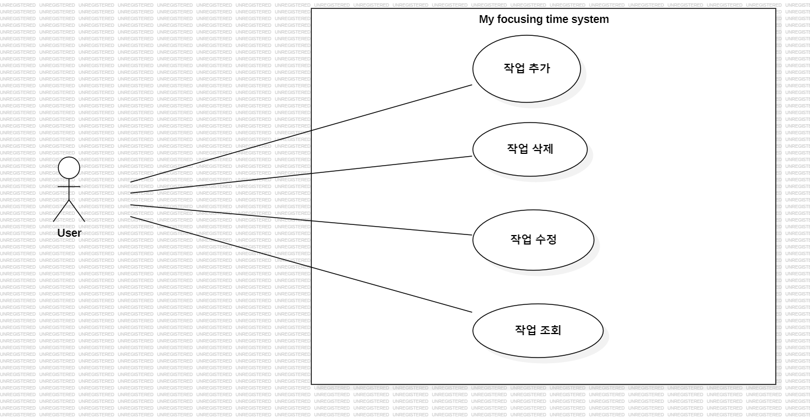

# My focusing time  
### Analysis document

---

| Student No | Name | E-mail |
|------------|------|--------|
| 22411976 | 신주현 | s5264075@gmail.com |

---

## [ Revision history ]

| Revision date | Version # | Description | Author |
|---------------|----------|-------------|--------|
|  04/11/2026   |  1.00    | First Writing | 신주현 |

---

# = Contents =

1. Introduction
2. Use case analysis  
3. Domain analysis  
4. User Interface prototype  
5. Glossary  
6. References

---

# 1.Introduction
## 1) Executive Summary

“My Focusing Time”은 사용자가 일상적인 할 일을 효율적으로 관리할 수 있도록 설계된 To-Do List 프로그램이다. 현대인들은 다양한 일정과 업무를 동시에 처리해야 하는 환경 속에서 개인적인 스케줄까지 함께 관리해야 하므로, 이를 보다 간편하고 체계적으로 정리할 수 있는 맞춤형 애플리케이션의 필요성이 증가하고 있다.

본 시스템은 기존 일정 관리 애플리케이션에서 발생하는 복잡한 스케줄 추가 과정과 비직관적인 인터페이스의 문제를 개선하고, 누구나 쉽게 사용할 수 있는 직관적인 사용자 환경을 제공하는 것을 목표로 한다. 사용자는 할 일을 추가, 수정 및 삭제할 수 있으며, 각 항목에 대해 완료 여부를 표시할 수 있다.

또한 우선순위 설정 기능을 통해 중요한 작업을 보다 효율적으로 관리할 수 있도록 구성하였다. “My Focusing Time”은 객체지향 프로그래밍 개념을 적용하여 구조적으로 설계되었으며, 유지보수성과 확장성을 고려하여 구현되었다.

---

# 2.Use case analysis

## 1) Use case diagram

## 2) Use case description

|  |  |
|------|------|
| Use Case #1 : 작업추가 |  
| GENERAL CHARACTERSTICS |
| Summary | 사용자가 작업을 추가하는 기능 |
| Scope | To-Do List 시스템 |
| Level | User Level |
| Author | 신주현 |
| Last Update | 2026-05-03 |
| Status | Analysis |
| Primary Actor | User |
| Preconditions | 애플리케이션이 실행된 상태여야 한다. |
| Trigger | 사용자가 작업 추가 기능을 선택할 때 |
| Success Post Condition | 작업이 시스템에 정상적으로 저장된다. 이후 사용자는 등록된 작업을 확인할 수 있다. |
| Failed Post Condition | 작업이 저장되지 않는다. 사용자는 작업 목록에서 해당 작업을 확인할 수 없다. |
| MAIN SUCCESS SCENARIO | 
| Step | Action |
| S | User가 작업을 추가한다. |
| 1 | User는 작업 제목, 일정, 우선순위 등의 정보를 입력한다. |
| 2 | User는 작업추가 버튼을 누른다. |
| 3 | 시스템은 입력된 정보를 검증한 후 작업을 저장한다. |
| 4 | 시스템은 작업 추가 완료 메시지를 출력하고 작업 목록 화면을 갱신한다. |
| EXTENSION SCENARIOS | 
| Step | Branching Action |
| 3 | 3a	입력 정보가 유효하지 않은 경우 |
| | 3a.1	시스템은 오류 메시지를 휴대폰 팝업 창으로 출력한다. |
| | 3b	필수 항목(제목 등)이 입력되지 않은 경우 |
| | 3b.1	시스템은 필수 입력값 누락 메시지를 휴대폰 팝업 창으로 출력한다. |
| RELATED INFORMATION |
| Performance | <= 3 Seconds |
| Frequency | 사용자당 하루 평균 2~5회 |
| Concurrency | 제한 없음 |
| Due Date| |

|  |  |
|------|------|
| Use Case #2 : 작업삭제 |  
| GENERAL CHARACTERSTICS |
| Summary | 사용자가 기존에 등록된 작업을 삭제하는 기능 |
| Scope | To-Do List 시스템 |
| Level | User Level |
| Author | 신주현 |
| Last Update | 2026-05-03 |
| Status | Analysis |
| Primary Actor | User |
| Preconditions | 애플리케이션이 실행된 상태이며, 삭제할 작업이 존재해야 한다. |
| Trigger | 사용자가 작업 삭제 기능을 선택할 때 |
| Success Post Condition | 선택한 작업이 시스템에서 정상적으로 삭제된다. |
| Failed Post Condition | 작업이 삭제되지 않으며, 기존 작업 목록이 유지된다. |
| MAIN SUCCESS SCENARIO | 
| Step | Action |
| S | User가 작업을 삭제하면서 시작된다. |
| 1 | User는 작업 목록에서 삭제할 작업을 선택한다. |
| 2 | User는 삭제 버튼을 누른다. |
| 3 | 시스템은 선택된 작업을 삭제한다. |
| 4 | 시스템은 작업 삭제 완료 메시지를 출력하고 작업 목록 화면을 갱신한다. |
| EXTENSION SCENARIOS | 
| Step | Branching Action |
| 2 | 2a	사용자가 삭제를 취소한 경우 |
| | 2a.1	시스템은 아무 작업도 수행하지 않고 이전 화면을 유지한다. |
| 3 | 3a	선택된 작업이 존재하지 않는 경우 |
| | 3a.1	시스템은 오류 메시지를 휴대폰 팝업 창으로 출력한다. |
| RELATED INFORMATION |
| Performance | <= 3 Seconds |
| Frequency | 사용자당 하루 평균 1~3회 |
| Concurrency | 제한 없음 |
| Due Date| |
